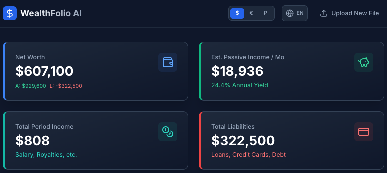
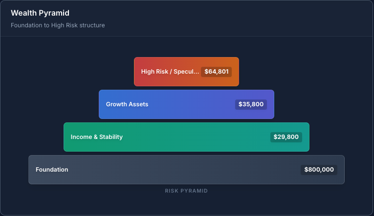
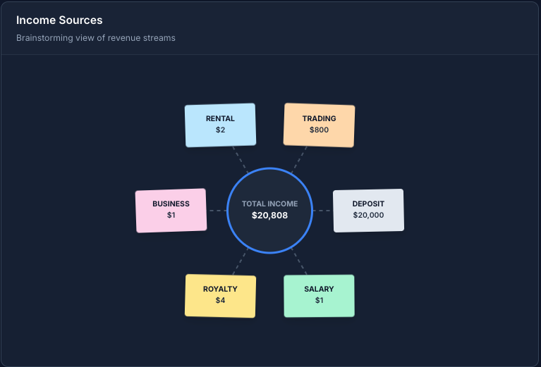
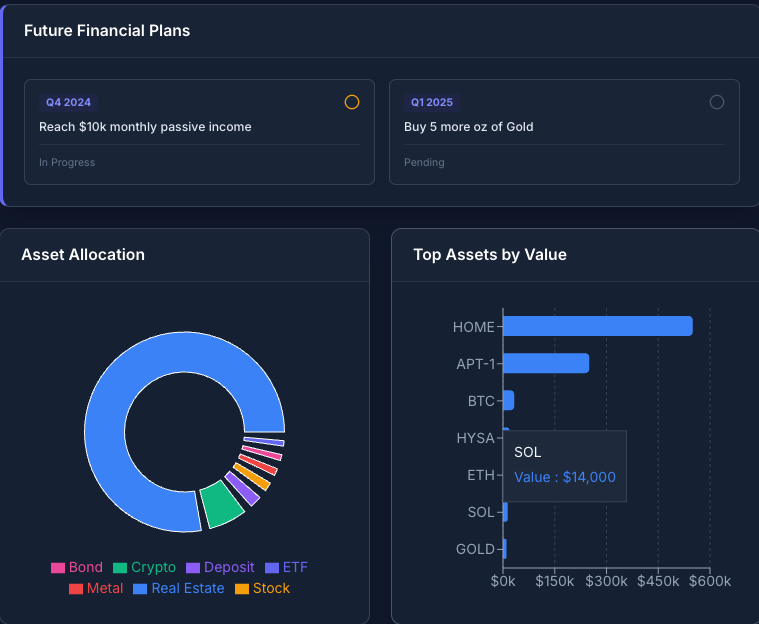
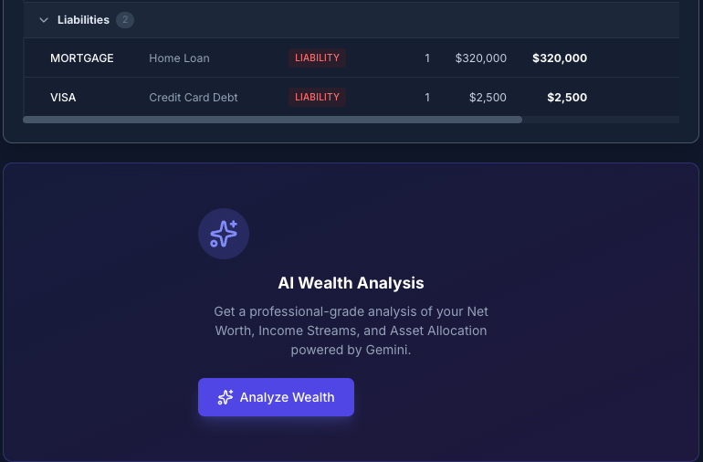

# WealthFolio AI: Intelligent Multi-Asset Portfolio Tracker 📈

**Net Worth. Cash Flow. AI Strategy.**

WealthFolio AI is a comprehensive, privacy-focused web application designed to track, visualize, and analyze your entire financial life. Unlike standard stock tickers, it aggregates diverse assets—from Crypto and Stocks to Real Estate, Gold, and Intellectual Property Royalties—alongside your liabilities and income streams.

It leverages **Google's Gemini 2.5 Flash API** to act as an on-demand personal financial advisor, providing detailed analysis of your net worth, diversification, and alignment with your future financial goals.

---

## 🌟 Why WealthFolio AI? (Key Value & Benefits)

* **Holistic View**: Breaks down the silos between your "Traditional Investments" (Stocks/Bonds), "Real World Assets" (Real Estate/Metals), "Income Streams" (Salary/Business), and "Liabilities" (Mortgages/Loans).
* **🧠 AI-Powered Advisory**: Instead of just showing numbers, the app uses GenAI (Gemini 2.5 Flash) to interpret your data. It assesses your risk exposure, suggests diversification strategies, and evaluates if you are on track to meet your quarterly financial goals.
* **🛡️ Client-Side Security & Privacy**: **Data never leaves your machine.** Your financial records are processed locally and stored exclusively in your browser's LocalStorage. Only anonymized, aggregated context (e.g., "70% in high-risk assets") is sent to the Gemini API for analysis, ensuring maximum privacy.
* **💰 Passive Income Focus**: Specifically tracks and calculates your estimated monthly passive income yields, helping you visualize your path to financial freedom.

---

## ✨ Core Functionality

### 1. Data Ingestion & Classification

* **Multi-Source Data Import**:
    * Upload **Excel (.xlsx)** files with multiple sheets.
    * Import directly from **Google Sheets** (via URL).
    * Includes a "Download Template" feature to get you started immediately.
* **Smart Asset Classification**:
    * Automatically categorizes assets into **Foundation** (Cash, Real Estate), **Growth** (Stocks, Gold), and **High Risk** (Crypto, Startups).
    * Distinguishes between **Capital Assets** (which add to Net Worth) and **Income Sources** (which add to Cashflow).
    * Detects **Liabilities** automatically to calculate true Net Worth.

### 2. Interactive Dashboard & Analysis

* **KPI Cards**: Instant summaries of Net Worth, Monthly Passive Income, and Total Debt.

<p align="center">
     
</p>
    
* **Wealth Pyramid**: Visualizes your risk structure from foundational to speculative assets. Get immediate visual feedback on your financial stability.

<p align="center">
    
</p>

* **Income Mind Map**: A node-based view of all your revenue streams and their interdependencies.

<p align="center">
    
</p>    

* **Financial Plans**: Track quarterly goals (e.g., "Buy House Q4") and get AI feedback on your probability of achievement.

<p align="center">
    
</p>    

* **History Tracking**: Save snapshots of your portfolio to track progress and performance over time.

<p align="center">
     
</p>


### 3. Global Settings & Localization

* Fully translated for **English** and **Russian**.
* Real-time currency conversion for **USD**, **EUR**, and **RUB**.

---

## 🛠️ Tech Stack & Project Structure

WealthFolio AI is a single-page application built for modern web development.

### Built With

* **Frontend:** React, TypeScript, Vite
* **AI Backend:** Google Gemini 2.5 Flash API
* **Data Visualization:** Custom D3-style charts

### Directory Breakdown

* `src/components`: Primary UI components including the Dashboard, File Upload, and specific Charts.
* `src/components/visualizations`: Custom logic for the Wealth Pyramid and Income Mind Map.
* `src/services`: Contains the core integration logic, including `geminiService.ts` for AI calls.
* `src/utils`: Utility functions like `excelParser.ts`, `localization.ts`, and `historyManager.ts` (LocalStorage).
* `src/types.ts`: TypeScript definitions for the entire financial data model.

---

## 💻 Getting Started (Run Locally)

Follow these steps to set up the project on your local machine (MacOS/Windows/Linux).

### Prerequisites
* **Node.js** (Version 18 or higher recommended).
* A **Google Gemini API Key** (Get one for free at [aistudio.google.com](https://aistudio.google.com/)).

### Installation Steps

1.  **Clone or Download** this repository to your local machine:
    ```bash
    git clone [https://github.com/your-username/assets_monitoring.git](https://github.com/your-username/assets_monitoring.git)
    cd assets_monitoring
    ```

2.  **Install Dependencies**:
    ```bash
    npm install
    ```

3.  **Configure API Key**:
    *   Add your API key inside .env file:
        ```env
        API_KEY=your_actual_api_key_here
        ```

4.  **Run the Application**:
    ```bash
    npm run dev
    ```

5.  **Open in Browser**:
    * The terminal will show a local URL (e.g., `http://localhost:5173`).
    * Open that link in your browser to start using WealthFolio AI.

---

## 📊 Data Formatting Guide

The application uses a robust parser that can handle Excel files with multiple sheets representing different asset classes (e.g., "Crypto", "Stocks", "Liabilities").

**Required Columns:**

| Column | Description |
| :--- | :--- |
| `Symbol` | Ticker or short ID (e.g., BTC, AAPL, House Address) |
| `Name` | Full asset name (e.g., Bitcoin, Apple Inc.) |
| `Quantity` | Number of units held |
| `PurchasePrice` | Your cost basis (per unit) |
| `CurrentPrice` | Current market value (per unit) |
| `Type` | *(Optional)* Stock, Bond, Crypto, etc. The app uses the **sheet name first** for classification. |
| `Monthly Income` or `APY` | *(Optional)* Used for passive income calculations. |

> *Tip: We highly recommend using the **"Download Sample Template"** button on the home screen to ensure your data is formatted perfectly for the parser.*

---

## 📌 Limitations & Future Work

WealthFolio AI is a powerful prototype, but has a few current limitations that we plan to address:

1.  **Static Data Reliance:** Currently requires manual import of data via Excel/Google Sheets. Future development will focus on integrating with market data APIs for real-time asset pricing.
2.  **Desktop Optimization:** The current dashboard layout is best viewed on larger screens. Future work will include a dedicated, responsive mobile view.
3.  **No Cloud Storage:** The privacy-first approach means data is client-side only. A future optional feature may offer encrypted cloud backup tied to a user account.

---

## 🔗 Authoritative Links

* [Google AI Studio](https://aistudio.google.com/) - Generate your Gemini API Key here.
* [Gemini API Documentation](https://ai.google.dev/gemini-api/docs) - The official documentation for the AI models used.
* [React Official Documentation](https://react.dev/)
